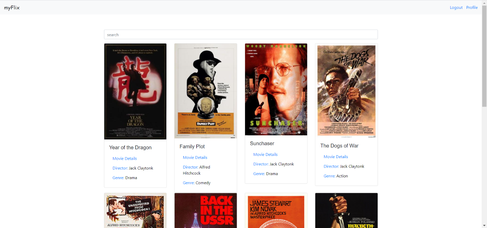
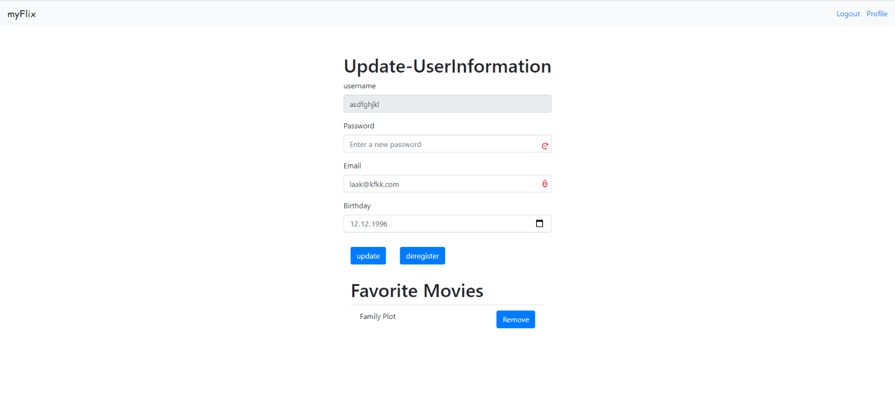

# myFlix

myFlix is the client-side of a movie database application built using React with existing server-side (REST API) and MongoDB database. 

This web application provides users with the access to information about different movies, directors and genres. Users are able to sign up, update personal information, and create a list of their favorite movies. 


View the back-end REST API database [here](https://github.com/wafachaari/movie-api).





## Quick Start 🚀

### Install dependencies 
```bash
npm install
```

### Build for development
```bash
parcel [path to index.html] 
```
*By default path to index.html is 'src/index.html'*
```bash
parcel src/index.html
```

**Note:** If you do not have parcel installed globally, your terminal will tell you that the command 'parcel' is not found. If this is the case, simply follow the instructions on [how to install parcel.js](https://parceljs.org/getting_started.html)

### Run application in browser
Parcel will run a local server on port: 1234

Open the application in your browser
``` 
http://localhost:1234/
```

---

## Features

- Allows users to see a list of all movies in the database
- Allows users to see a fliter list of all movies in the database by title
- Allows users to get detailed information about a single movie by movie title
- Allows users to get detailed information about a genre by genre name
- Allows users to get detailed information about a director by name
- Allows new users to create an user account
- Allows existing users to update their user info or to delete their account
- Allows existing users to add or remove movies to/from their list of favorites

For more information about each endpoint of the REST API, see *documentation.html*.

### Author

[Wafa Chaari](https://github.com/wafachaari)

 
